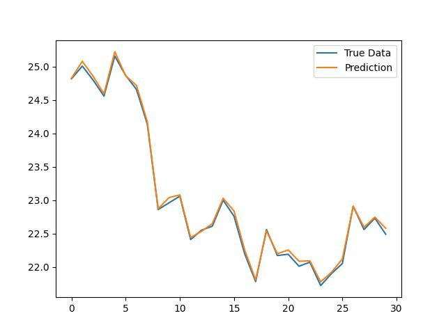
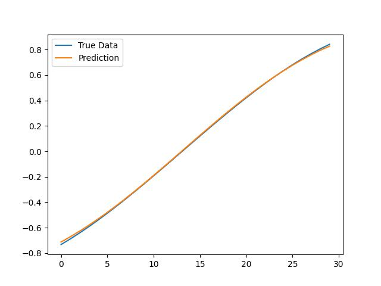

# LSTM对股票的收益进行预测（Sequential 序贯模型，Keras实现）

## 步骤：

* 股票数据准备

* 股票数据预处理

  * 数据特征归一化（标准化）

    >使用scikit-learn库中的**MinMaxScaler**预处理类实现数据集的规范化

  * 将数据集转化为有监督学习问题

    >在实验中，定义一个名为**series_to_supervised()**函数*，*该函数采用单变量或多变量时间序列并将其构建为监督学习数据集。

* 股票数据划分为训练集和测试集

  >将处理后的数据集划分为训练集和测试集。本实验将按0.85比划分数据作为测试集，其余作为训练集。将训练集和测试集的最终输入（X）转换为为LSTM的输入格式，即[samples,timesteps,features]。
  >
  >Keras LSTM层的工作方式是通过接收3维（N，W，F）的数字阵列，其中N是训练序列的数目，W是序列长度，F是每个序列的特征数目。
  >
  >```python
  ># 转化为三维数据
  ># reshape input to be 3D [samples, timesteps, features]
  >train_X = train_X.reshape((train_X.shape[0], 1, train_X.shape[1]))
  >test_X = test_X.reshape((test_X.shape[0], 1, test_X.shape[1]))
  >```

* 模型构建及其预测

  >**通过定义model类建立模型，在Sequential_lstm_test\core\model.py中**
  >
  >其中的方法：
  >
  >* load_model # 加载模型，参数为.h5文件路径
  >* build_model # 建立模型，参数为：
  >   * configs:配置文件
  >   * input_timesteps
  >   * input_dim
  >* train # 训练模型，参数为：
  >   * x
  >   * y
  >   * epochs
  >   * batch_size
  >   * validation_data
  >   * verbose
  >   * shuffle
  >   * validation_freq
  >   * save_dir
  >* predict_point_by_point # 预测函数,参数为：
  >   * test_x

* 实验效果：

  * 预测股票收盘价：

    

  * 正弦波函数：	

    

​		
