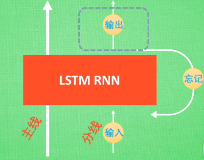
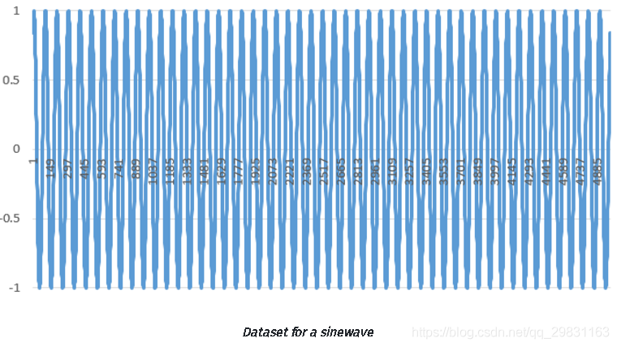
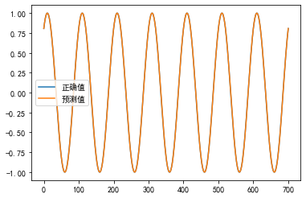
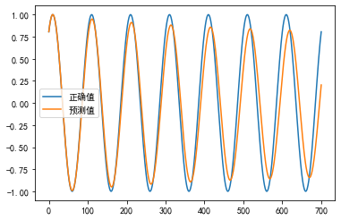
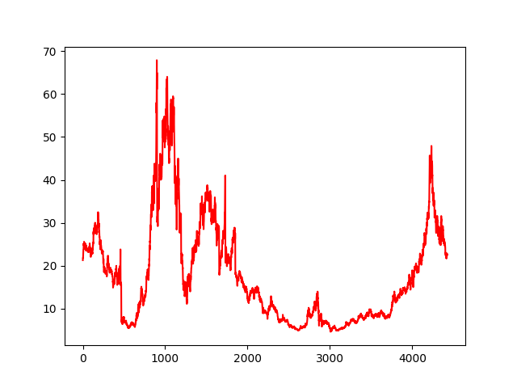
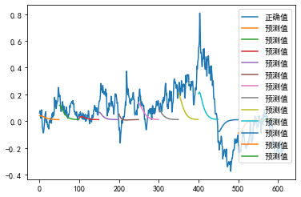
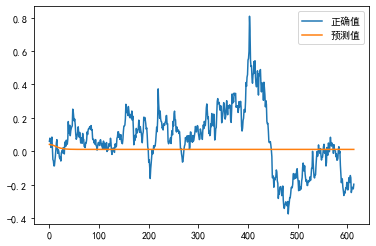
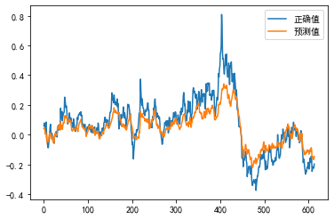

# 浅谈深度学习：基于对LSTM项目`LSTM Neural Network for Time Series Prediction`的理解与回顾，构建属于自己的LSTM测试代码

>#### 总包含文章：
>
>* [一个完整的机器学习模型的流程](https://blog.csdn.net/linxinloningg/article/details/121685647)
>* [浅谈深度学习：了解RNN和构建并预测](https://blog.csdn.net/linxinloningg/article/details/121881042)
>* [浅谈深度学习：基于对LSTM项目`LSTM Neural Network for Time Series Prediction`的理解与回顾](https://blog.csdn.net/linxinloningg/article/details/121881068)
>* [浅谈深度学习：LSTM对股票的收益进行预测（Sequential 序贯模型，Keras实现）](https://blog.csdn.net/linxinloningg/article/details/121881117)
>
>## 前言
>
>根据之前RNN的学习，我们还了解到了可以称作为RNN的加强版，至于有多强，我们可以通过一篇文章先去阅读理解和感慨一下：["TIME SERIES PREDICTION USING LSTM DEEP NEURAL NETWORKS"](https://www.altumintelligence.com/articles/a/Time-Series-Prediction-Using-LSTM-Deep-Neural-Networks)
>
>单单看文章似乎还不能足以感受LSTM的强大，训练数据也不是我们强大的中国股市的，但好在文中有代码连接，我们可以尝试着复现一下
>
>翻译文章参考[LSTM股票预测](https://blog.csdn.net/qq_29831163/article/details/89475044)
>
>传统的神经网络不能够解释依赖于信息和上下文的输入序列， 信息可以是句子中的先前出现的单词，用以允许上下文预测下一个单词可能是什么，或者它可以是序列的时间信息，它将允许该序列的基于时间的元素的上下文。简而言之，传统的神经网络中，各输入是独立的（ stand-alone data vector ）并且没有记忆的概念。RNN有梯度消失的问题（Vanishing Gradient Problem），而LSTM通过神经元在其管道中保持记忆的上下文，解决了序列和时间问题，因此不存在影响性能的梯度消失问题。
>
>#### 代码仓库：[**TIME_SERIES_PREDICTION_USING_LSTM_DEEP_NEURAL_NETWORKS**](https://github.com/linxinloningg/lstm_learn_test/tree/main/TIME_SERIES_PREDICTION_USING_LSTM_DEEP_NEURAL_NETWORKS)
>
>### 构建代码之前我还是强烈推荐观看b站科普'[什么是 LSTM RNN 循环神经网络 (深度学习)?](https://www.bilibili.com/video/BV1Vx411j7xF?)'
>
>了解LSTM的模型结构：
>
>
>
>这样才能知道网上代码layer所构建层的意义
>
>##### 套用自己的数据，代码复现：
>
>## 实验
>
>>### 实验一：正弦波预测
>
>>模型需要的数据在sinewave.csv  文件中
>
>>
>
>>预测结果：
>
>>* 用逐点预测
>
>>
>
>>* 完整的序列预测
>
>>
>
>>## 实验二：股票预测
>
>>模型需要的数据在sh600031.csv  文件中
>
>>
>
>>预测结果：
>
>>* **多序列预测**
>
>>
>
>>* **全序列预测**
>
>>
>
>>* **单个逐点预测**
>
>>
>
>## 分析：
>
>* 在**单个逐点预测上运行数据可以非常接近地匹配收益**的效果。 但这有点欺骗性。 经过仔细检查，预测线由奇异的预测点组成，这些预测点在它们后面具有整个先前的真实历史窗口。 因此，网络不需要了解时间序列本身，除了每个下一个点很可能不会离最后一点太远。 因此，即使它得到错误点的预测，下一个预测也会考虑真实历史并忽略不正确的预测，但又会允许发生错误。一个重要的用途是，虽然它不知道确切的下一个价格是多少，但它确实**能够准确地表示下一个价格的范围。此信息可用于波动率预测等（能够预测市场中高波动率或低波动率的时段对于特定交易策略可能非常有利），还可用于异常检测的良好指标。**异常检测可以通过预测下一个点，然后将其与真实数据进行比较来实现，如果真实数据值与预测点明显不同，则可以将该数据点进行异常标记。
>* 全序列预测至少可以说是这个超参数的训练模型中最没用的预测，但我们可以快速发现，最优的模式是收敛到时间序列的某个均衡，平均回归交易者可能会在那个阶段宣称，该模型只是找到价格序列在波动率被消除时将恢复的平均值。
>* 多序列预测是完整序列预测的混合，因为它仍然使用测试数据初始化测试窗口，预测下一个点，然后使用下一个点创建一个新窗口。但是，一旦输入窗口完全由过去的预测组成，它就会停止，向前移动一个完整的窗口长度，用真实的测试数据重置窗口，然后再次启动该过程。 实质上，**这给出了对测试数据的多个趋势线预测，以便能够分析模型能够获得未来动量趋势的程度。**
>
>## 结论：
>
>目前使用上述vanilla LSTM仍 存在一些局限性，特别是在使用金融时间序列时，该系列本身具有很难建模的非平稳特性（尽管使用贝叶斯深度神经网络方法已经取得了进展） 解决时间序列的非平稳性）。 同样对于一些应用，还发现基于注意力的神经网络机制的新进展已经超过LSTM（并且LSTM与这些基于注意力的机制相结合已经超出了它们自身）。
>
>然而，截至目前，LSTM在更经典的统计时间序列方法上提供了显着的进步，能够非线性地建模关系并且能够以非线性方式处理具有多个维度的数据。 

