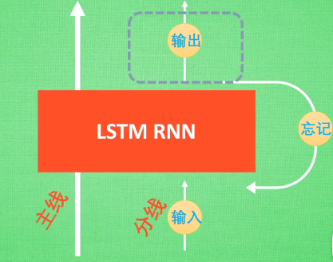
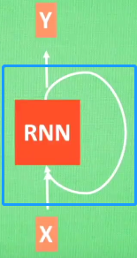
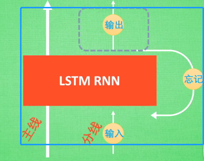
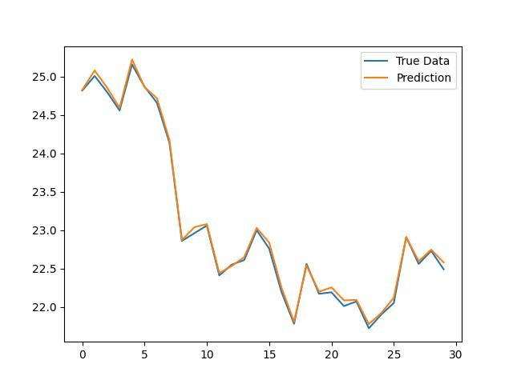
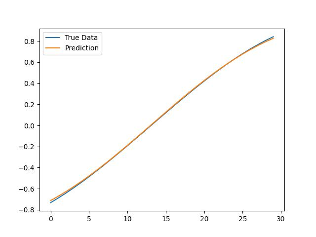
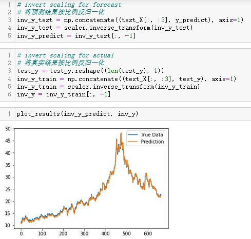
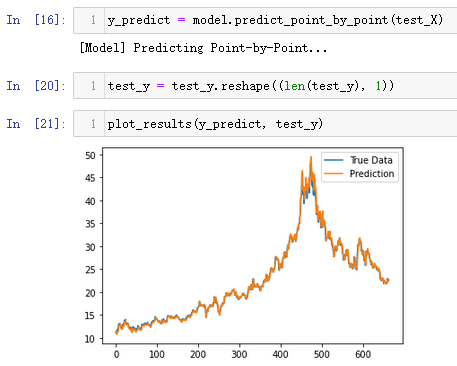
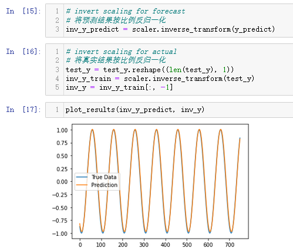
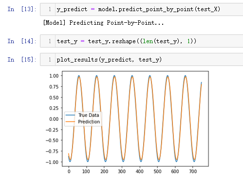

# 浅谈深度学习：LSTM对股票的收益进行预测（Sequential 序贯模型，Keras实现）

#### 总包含文章：

* [一个完整的机器学习模型的流程](https://blog.csdn.net/linxinloningg/article/details/121685647)
* [浅谈深度学习：了解RNN和构建并预测](https://blog.csdn.net/linxinloningg/article/details/121881042)
* [浅谈深度学习：基于对LSTM项目`LSTM Neural Network for Time Series Prediction`的理解与回顾](https://blog.csdn.net/linxinloningg/article/details/121881068)
* [浅谈深度学习：LSTM对股票的收益进行预测（Sequential 序贯模型，Keras实现）](https://blog.csdn.net/linxinloningg/article/details/121881117)

### 目录：

* #### LSTM简介

* #### 代码实现

* #### 其他尝试

### LSTM 简介：

同RNN学习一样，我们只是先浅谈，所以只用知道两点就足够了：

* 1. LSTM是什么，依旧百度百科：长短期记忆网络（[LSTM](https://baike.baidu.com/item/LSTM/17541102)，Long Short-Term Memory）是一种时间循环神经网络，是为了解决一般的[RNN](https://baike.baidu.com/item/RNN/5707183)（[循环神经网络](https://baike.baidu.com/item/循环神经网络/23199490)）存在的长期依赖问题而专门设计出来的，所有的RNN都具有一种重复神经网络模块的链式形式。在标准RNN中，这个重复的结构模块只有一个非常简单的结构，例如一个tanh层。显而易见，这个LSTM就是加强版的RNN，所以我们接下从代码构建少看看多了些什么

  2. LSTM的模型是怎样的，这里我强烈推荐观看b站科普'[什么是 LSTM RNN 循环神经网络 (深度学习)?](https://www.bilibili.com/video/BV1Vx411j7xF?)'

     里面所谈到LSTM模型的结构是这样的：

     

##### 代码仓库：[**[lstm_test](https://github.com/linxinloningg/lstm_learn_test/tree/main/lstm_test)**](https://github.com/linxinloningg/lstm_learn_test/tree/main/TIME_SERIES_PREDICTION_USING_LSTM_DEEP_NEURAL_NETWORKS)

这是对文章给予的原代码进行更加详细的拆解和试验的部分，基于自己的理解去修改一下代码，方便自己引用和构建

##### 代码仓库：[more_detailed](https://github.com/linxinloningg/lstm_learn_test/tree/main/more_detailed)

#### 根据之前的学习，构建属于自己的LSTM测试代码

##### 步骤：

* 股票数据准备

* 股票数据预处理

  * 数据特征归一化（标准化）

    >使用scikit-learn库中的**MinMaxScaler**预处理类实现数据集的规范化

  * 将数据集转化为有监督学习问题

    >在实验中，定义一个名为**series_to_supervised()**函数*，*该函数采用单变量或多变量时间序列并将其构建为监督学习数据集。

* 股票数据划分为训练集和测试集

  >将处理后的数据集划分为训练集和测试集。本实验将按0.85比划分数据作为测试集，其余作为训练集。将训练集和测试集的最终输入（X）转换为为LSTM的输入格式，即[samples,timesteps,features]。
  >
  >Keras LSTM层的工作方式是通过接收3维（N，W，F）的数字阵列，其中N是训练序列的数目，W是序列长度，F是每个序列的特征数目。
  >
  >```python
  ># 转化为三维数据
  ># reshape input to be 3D [samples, timesteps, features]
  >train_X = train_X.reshape((train_X.shape[0], 1, train_X.shape[1]))
  >test_X = test_X.reshape((test_X.shape[0], 1, test_X.shape[1]))
  >```

* 模型构建及其预测

  * 构建之前，我们先去看configs.json配置文件中是如何配置这个模型的：

    ```json
    "layers": [
      {
        "type": "lstm",
        "neurons": 100,
        "return_seq": true
      },
      {
        "type": "dropout",
        "rate": 0.2
      },
      {
        "type": "lstm",
        "neurons": 100,
        "return_seq": true
      },
      {
        "type": "lstm",
        "neurons": 100,
        "return_seq": false
      },
      {
        "type": "dropout",
        "rate": 0.2
      },
      {
        "type": "dense",
        "neurons": 1,
        "activation": "linear"
      }
    ```

    看上去跟构建RNN的模型没什么两样嘛，这是为什么呢。

    其实区别就是构建时引用的库文件不一样，我们这里引用的是keras的LSTM。

    而这两者区别对应的就是

    

    中间的部分不一样，训练数据还是一样的传，预测数据还是一样的预测。而这中间，已经有伟人把轮子造了，我们用就好了。

  >**通过定义model类建立模型，在Sequential_lstm_test\core\model.py中**
  >
  >其中的方法：
  >
  >* load_model # 加载模型，参数为.h5文件路径
  >* build_model # 建立模型，参数为：
  >   * configs:配置文件
  >   * input_timesteps
  >   * input_dim
  >* train # 训练模型，参数为：
  >   * x
  >   * y
  >   * epochs
  >   * batch_size
  >   * validation_data
  >   * verbose
  >   * shuffle
  >   * validation_freq
  >   * save_dir
  >* predict_point_by_point # 预测函数,参数为：
  >   * test_x

* 实验效果：

  * 预测股票收盘价：

    

  * 正弦波函数：	

    

  	#### 此外代码进行了四组实验：

* test_1 股票数据仅作归一化处理：

  

* test_1_1 股票数据不作归一化处理：

  

* test_2 正弦数据仅作归一化处理：

  

* test_2_1正弦数据不作归一化处理：

  

从结果来看，似乎相差不大，大伙可以减少LSTM层尝试一下，结果是否变化变大