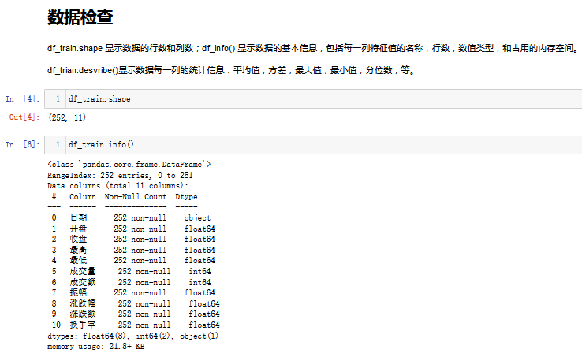
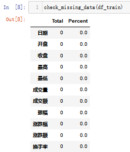
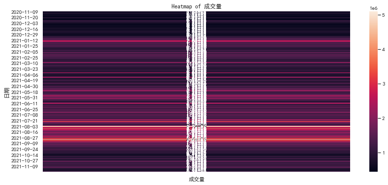
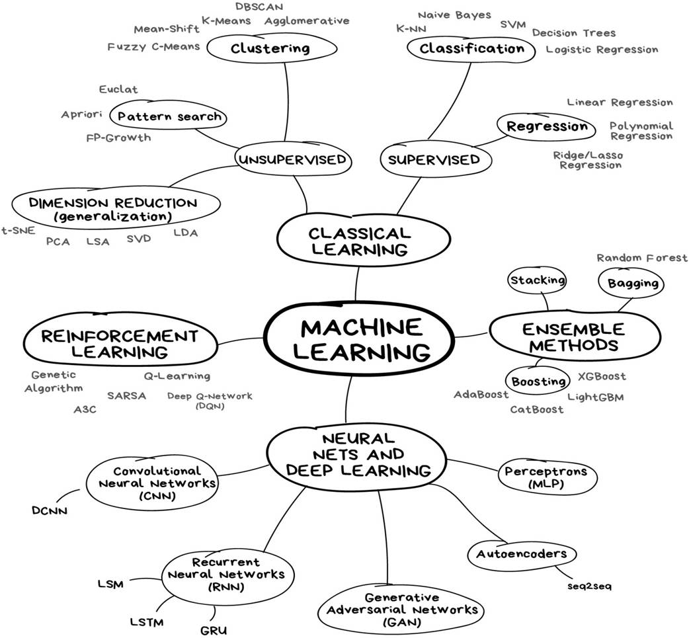
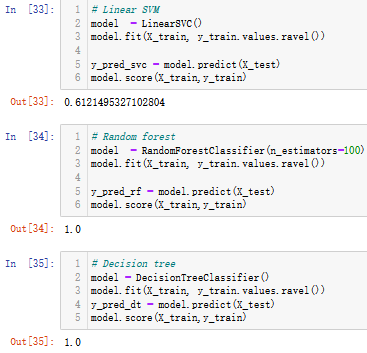

# 浅谈深度学习：一个完整的机器学习模型的流程

* 总包含文章：
  * [一个完整的机器学习模型的流程](https://blog.csdn.net/linxinloningg/article/details/121685647)
  * [浅谈深度学习：了解RNN和构建并预测](https://blog.csdn.net/linxinloningg/article/details/121881042)
  * [浅谈深度学习：基于对LSTM项目`LSTM Neural Network for Time Series Prediction`的理解与回顾](https://blog.csdn.net/linxinloningg/article/details/121881068)
  * [浅谈深度学习：LSTM对股票的收益进行预测（Sequential 序贯模型，Keras实现）](https://blog.csdn.net/linxinloningg/article/details/121881117)

### 前言：

机器学习作为人工智能的一个分支，在金融行业得到广泛的应用。然而，多数金融服务企业缺乏对机器学习价值的深入了解，其原因除了企业对机器学习缺乏深入的了解，对其价值抱有不切实际的期望，或者因为机器学习的研究和开发太高而望而却步，数据科学家和机器学习专家短缺也是重要的原因。在机器学习的推广方面，老企业因为需要更新数据和IT架构，推广力度和研发进度往往缺乏动力。

#### 代码仓库：[machine_learn](https://github.com/linxinloningg/lstm_learn_test/tree/main/machine_learn)

本文介绍建立机器学习模型的主要步骤。

**前期准备：软件包和数据加载采集**

收集原始数据是机器学习过程的第一步，它从各个渠道被采集而来。数据的数量和质量直接影响模型的性能。在监督学习的场景中还需要对数据进行标记。例如，情感分析模型需要用标签标记。有时数据标记的工作往往非常耗时耗力，在某些场景中，这类工作不仅对人的专业背景要求高，而且完成标记所需的周期长。

> **1. 数据处理和分析(EDA)**

> 原始数据往往有缺失信息或者噪音较多，需要将这些数据进行预处理，得到有效的训练数据。机器学习模型的数据预处理过程主要包含数据归一化（包括样本尺度归一化、逐样本的均值相减、标准化）和数据白化。另外，我们还需要将数据分为三种数据集，即：包括用来训练模型的训练集、开发过程中用户调参的验证集以及测试时所使用的测试集。
>
> 
>
> 

> **2. 数据可视化(Data Visualization)**

> 数据可视化(Data Visualization)在机器学习中被大量使用，帮助用户直观地分析数据的特性，以及数据之间的相关性。如果使用Python开发机器学习模型，常用的可视化数据包有Matplotlib, Seaborn。此外，还可以通过一些数据分析软件帮助我们找寻数据间的关系与结构，进而设计更好的模型，例如power bi
>
> 

> **3. 特征值工程**

>在机器学习中，特征值(feature)是可度量的，反映观察对象特征的度量。特征值一般是数值型的，在特定应用中，结构化的或者图形化的特征值在模式识别中也有广泛的应用。当一个观察对象具有多维的特征时，特征值就构成了一个特征向量(feature vector)。所有观察对象的特征向量构成的空间就是特征空间(feature space)。 
>
> 特征值的重要性在于，它的选取和构造直接影响了模型的性能。原始数据的选取，特征值的构造和选择组成了特征值工程的主要部分。

>**4. 机器学习模型**

> * **选择模型**

> 机器学习模型类型众多，通常，根据可以实现的目标被分为三种主要类型：监督型模型，非监督型模型，强化学习模型。模型的选择依赖于数据的类型和问题本身需要达到的目标。以下举例说明常用的模型和相对应的应用场景。

> 销售价格的预测，常用 Logistic Regression,  XGBoost；图像处理，语音处理常用深度学习模型(Convolutional Neural Networks, Recurrent  Neural Networks)；错误信息检测常用Random Forest；试错学习常用 Reinforcement  Learning；普通的分类问题常用 Fully Connected Networks或者Support Vector Machines。
>
> 

> * **训练模型**

> 在正式开始模型训练之前，需要针对我们的训练目标进行分类。理解目标的本质对选择训练的方式至关重要。前期算法工程师需要通过测试集和训练集，在集中可能的算法中做一些测试，再根据测试的结果选择具体的算法。有时候最终结果可能是多个模型结果的组合。

> * **模型评估**

> 利用在数据预处理中准备好的测试集对模型进行测试。由于测试集对模型来说是完全新的数据，因此可以客观地度量模型在现实世界中的性能表现。模型的效果通常以“拟合程度”来形容。值得注意的是，机器训练模型中经常出现过度拟合和拟合不足。
>
> 

> * **参数调整**

> 对模型评估结束后，可以通过调参对训练过程进行优化。参数可以分为两类，一类是超参数，即需要在训练前手动设置的参数，另一种是不需要手动设置、在训练过程中可以自动被调整的参数。调参的过程是一种基于数据集、模型、和训练过程细节的实证过程。

> 根据模型测试的结果，调整特征值的选取，或者调整模型的参数，甚至尝试不同的模型。这是一个不断迭代的过程，直到取得满意的结果。

> * **预测**

> 得到最终的模型以后，对新的数据进行预测得到结果。