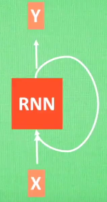
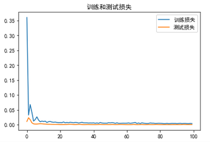
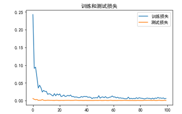
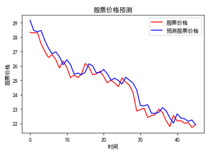

# 浅谈深度学习：了解RNN和构建并预测

#### 总包含文章：

* [一个完整的机器学习模型的流程](https://blog.csdn.net/linxinloningg/article/details/121685647)
* [浅谈深度学习：了解RNN和构建并预测](https://blog.csdn.net/linxinloningg/article/details/121881042)
* [浅谈深度学习：基于对LSTM项目`LSTM Neural Network for Time Series Prediction`的理解与回顾](https://blog.csdn.net/linxinloningg/article/details/121881068)
* [浅谈深度学习：LSTM对股票的收益进行预测（Sequential 序贯模型，Keras实现）](https://blog.csdn.net/linxinloningg/article/details/121881117)

### 目录：

* #### RNN简介

* #### 代码实现

* #### 其他尝试

##### 代码仓库：[rnn_test](https://github.com/linxinloningg/lstm_learn_test/tree/main/rnn_test)

### RNN简介：

由于这是先浅谈因为我觉着只要先了解两点就够了：

* 1. RNN是什么，百科百科解释：循环神经网络（Recurrent Neural Network, RNN）是一类以[序列](https://baike.baidu.com/item/序列/1302588)（sequence）数据为输入，在序列的演进方向进行[递归](https://baike.baidu.com/item/递归/1740695)（recursion）且所有节点（循环单元）按链式连接的[递归神经网络](https://baike.baidu.com/item/递归神经网络/16020230)（recursive neural network），相信看完还是不懂，但起码知道RNN这三个字母简称的来源，但也足够了。

  2. RNN的模型是怎样的，这里我强烈推荐观看b站科普'[什么是 LSTM RNN 循环神经网络 (深度学习)?](https://www.bilibili.com/video/BV1Vx411j7xF?)'

     里面所谈到RNN模型的结构是这样的：

     

     **这个很重要我们要知道模型的结构才能知道怎样去构建**，请记住！

#### 代码构建

根据之前的机械学习我们知道了建模的主要过程，无非就是：

* 导入数据和清洗数据

* 可视化找规律（这里我们不用因为是用一个数据特征预测）

* 构建特征值和归一化（这里我们也不用构建其他特征值，但为了更好学习我们需要归一化）

* 模型构建和训练

  * 这里要用到之前的模型的结构的知识了

    * X即是我们输入进去的训练数据集
    * 中间的RNN，这里用到了keras的SimpleRNN
    * Y即是输出值，也就是我们的预测值

    因此这个模型的结构用代码实现就是

    ```python
    model = tf.keras.Sequential([
        SimpleRNN(80),
        Dropout(0.2),
        Dense(1)
    ])
    ```

  * 有了模型就可以接着训练了，来看下训练效果：

    

  * 有人可能发现了，上面的代码似乎只是一层RNN，那肯定还可以用多层RNN

    ```python
    model = tf.keras.Sequential([
        SimpleRNN(80, return_sequences=True),
        Dropout(0.2),
        SimpleRNN(100),
        Dropout(0.2),
        Dense(1)
    ])
    ```

    

  * 预测效果：

    

    一切看起来都还不赖的样子嘛~

##### 除了以上代码外，实验还进行了如下尝试：

* 原始数据训练

* * 单特征（用一个特征预测此特征）
  * 多特征（用多个特征预测一个特征）
* 移动平均修正
* * 多特征（用多个特征预测一个特征）
  * 预测涨跌（添加一个特征‘涨跌’，并加以预测）